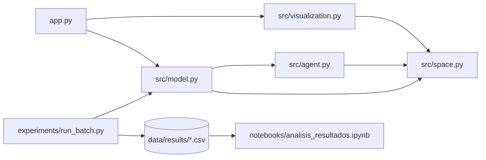
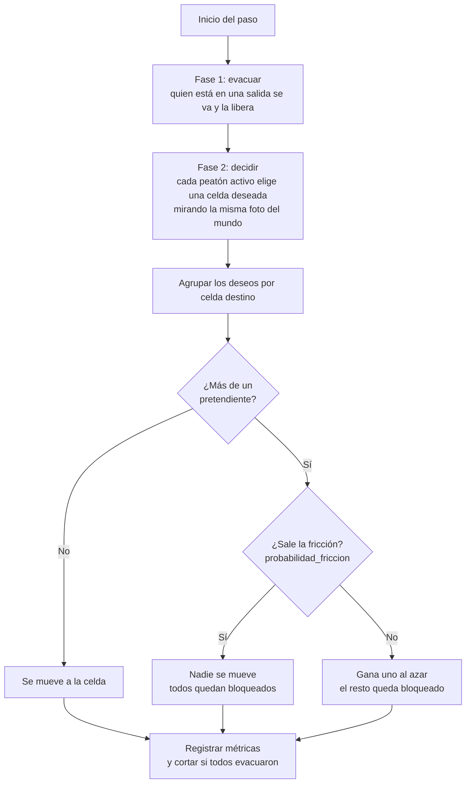
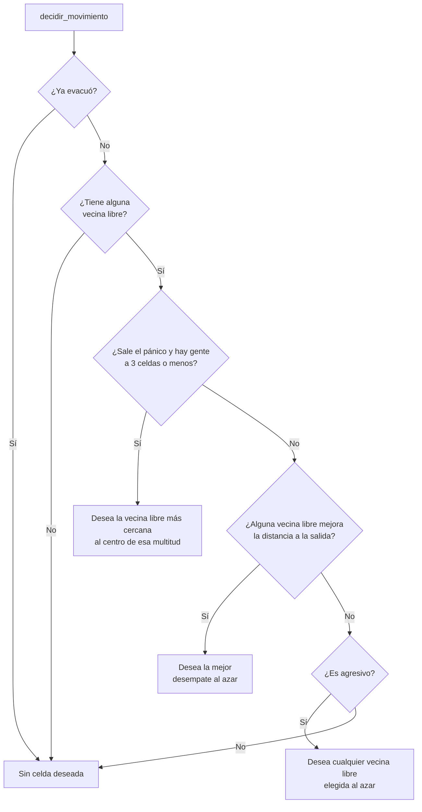
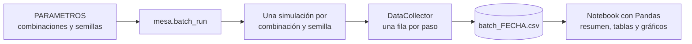

# Arquitectura

Cómo se relacionan las piezas del proyecto y qué hace el código en cada paso
de la simulación. Los diagramas están en [Mermaid](https://mermaid.js.org):
se ven renderizados en GitHub y en la mayoría de los visores de Markdown.

## 1. Módulos y dependencias

| Módulo | Responsabilidad |
|---|---|
| `space.py` | El mapa: grilla, salidas, muros y floor field. No sabe nada de peatones. |
| `agent.py` | Un peatón: decide a qué celda querría moverse. No mueve a nadie. |
| `model.py` | Crea todo, ejecuta cada paso, resuelve conflictos y registra métricas. |
| `visualization.py` | Dibuja el estado actual del modelo. Solo lo lee. |
| `app.py` | Arma el escenario y el visualizador interactivo. |
| `run_batch.py` | Corre muchas simulaciones y guarda el resultado en CSV. |

Una regla que se mantiene en todo el proyecto: cada módulo solo conoce a los
que están "debajo" en el diagrama. `space.py` no importa a nadie del proyecto,
por eso se pudo cambiar el tipo de vecindad con una sola línea.

## 2. Un paso de la simulación

Es lo que hace `EvacuacionModel.step()`.

La fase 3 (resolver) es la razón de que la decisión y el movimiento estén
separados: si cada peatón se moviera apenas decide, el que va segundo ya vería
la celda ocupada y nunca habría un conflicto real que resolver.

## 3. Cómo decide un peatón

Es lo que hace `Peaton.decidir_movimiento()`. Devuelve la celda que querría
ocupar (o ninguna) y si existía alguna celda que lo acercara a la salida.

## 4. Qué información guarda cada pieza

**En cada celda del espacio** (`celda.properties`):

| Clave | Valor |
|---|---|
| `es_salida` | `True` si la celda es una salida |
| `es_muro` | `True` si la celda es una pared |
| `distancia_a_salida` | Pasos hasta la salida más cercana (infinito si es inalcanzable) |

**En cada peatón:**

| Atributo | Para qué sirve |
|---|---|
| `cell` | Celda donde está parado (`None` una vez evacuado) |
| `evacuado` | Si ya salió |
| `bloqueado` | Si quería avanzar y no pudo (lo fija el modelo) |
| `agresivo` | Si se desvía en vez de esperar |
| `seguido` e `historial` | Si se le dibuja el recorrido, y las celdas por las que pasó |

**En el modelo:** `espacio`, `probabilidad_friccion`, `probabilidad_panico`,
`pasos_transcurridos` y `peaton_seguido`. El `DataCollector` registra
`evacuados`, `restantes` y `bloqueados` en cada paso.

## 5. Flujo de datos del análisis (Big Data)

Cada fila del CSV es un paso de una corrida. El notebook primero resume (una
fila por corrida, con el paso final) y recién después compara
configuraciones.

## 6. Dónde tocar para agregar algo

| Quiero... | Toco... |
|---|---|
| Un nuevo tipo de celda (por ejemplo una zona lenta) | `space.py` |
| Una nueva regla de movimiento o comportamiento | `agent.py` (`decidir_movimiento`) |
| Cambiar cómo se resuelven los conflictos o agregar una métrica | `model.py` |
| Cambiar cómo se ve | `visualization.py` |
| Probar otro escenario en vivo | `app.py` |
| Comparar parámetros en masa | `experiments/run_batch.py` |
