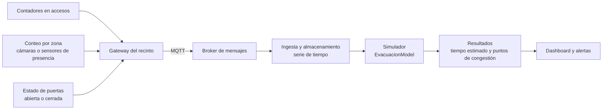

# IoT: extensión de arquitectura (propuesta, no implementada)

El proyecto declara tres pilares de Industria 4.0. Dos están implementados:
**simulación** (el modelo y el visualizador) y **big data y análisis** (las
corridas Monte Carlo y el notebook con Pandas). Este documento describe el
tercero, **IoT**, como una propuesta de cómo se conectaría el simulador con
datos de sensores reales. **Nada de esto está programado**: es el diseño de
cómo se haría.

## 1. La idea

Hoy el simulador parte de datos inventados: cuánta gente hay y dónde está se
define a mano. En un evento real esos datos se pueden medir. La propuesta es
que sensores en el recinto alimenten al modelo, de modo que la simulación
funcione como un **gemelo digital**: una copia del recinto que arranca con el
estado real y permite preguntar "si hubiera que evacuar ahora, ¿cuánto
tardaríamos y dónde se amontonaría la gente?".

## 2. Arquitectura propuesta



| Capa | Qué hace | Ejemplo |
|---|---|---|
| Sensores | Miden el recinto | Contadores en las entradas, conteo de personas por zona, sensor de estado de puerta |
| Gateway y mensajería | Reúne y transporta los datos | Un protocolo liviano como MQTT |
| Ingesta | Guarda los datos con su marca de tiempo | Base de datos de series de tiempo |
| Simulador | Usa el último estado conocido como punto de partida | `EvacuacionModel` |
| Salida | Muestra el resultado a quien opera el evento | Dashboard (el `dashboard/` reservado para Streamlit) |

## 3. Qué dato alimentaría qué parte del modelo

| Dato del sensor | Parámetro del modelo | ¿El código actual lo soporta? |
|---|---|---|
| Personas dentro del recinto | `num_agentes` | Sí |
| Estado de una puerta (abierta o cerrada) | `salidas` / `muros` | Parcial: se pueden pasar al crear el modelo, pero no cambiarlas durante la corrida |
| Cuánta gente hay en cada zona | Posiciones iniciales | No: hoy los peatones se ubican al azar en todo el recinto |
| Planta real del recinto | `ancho`, `alto`, `salidas`, `muros` | No: el recinto está fijo en `app.py` (es el ítem de "recinto definido por el usuario") |
| Entrada de gente a lo largo del tiempo | — | No: todos los peatones existen desde el paso 0 |

Para soportarlo habría que agregar al menos tres cosas: ubicar a los peatones
según un conteo por zona, poder cerrar o abrir una salida durante la corrida
(convertir esa celda en muro y recalcular el floor field) y cargar el recinto
desde un archivo.

## 4. Cómo simularlo sin hardware

Como no hay sensores reales, el pilar se puede demostrar **al revés**: el
simulador ya genera datos parecidos a los que mediría un sensor, y se pueden
emitir como una secuencia de eventos con marca de tiempo.

El `DataCollector` ya registra por paso `evacuados`, `restantes` y
`bloqueados`. Un evento sintético podría tener esta forma:

```json
{"timestamp": "2026-11-05T20:31:07Z", "sensor": "salida-derecha", "tipo": "conteo", "personas": 3}
```

Un script chico podría recorrer una corrida y publicar esos eventos a un
broker local (por ejemplo Mosquitto), y otro proceso consumirlos y
graficarlos. Eso alcanzaría para mostrar el flujo completo
sensor, mensajería, ingesta y visualización sin comprar nada. Para que existan
conteos *por salida* hace falta la métrica de "qué salida usó cada peatón",
que figura como pendiente en el tablero del proyecto.

## 5. Límites y cuidados

- **Privacidad**: alcanza con *contar* personas. No hace falta identificar a
  nadie, y conviene que ningún dato guardado permita reconocer individuos.
- **Calidad del dato**: los sensores de conteo se descalibran y pierden
  mensajes; el modelo debería tolerar datos faltantes o desfasados.
- **Validez de la predicción**: el simulador no está calibrado con
  evacuaciones reales (ver las limitaciones en el
  [marco teórico](marco_teorico.md)). Sus resultados sirven para **comparar
  configuraciones**, no como pronóstico exacto de tiempos.
- **Seguridad**: un sistema así recibiría datos de campo, así que necesitaría
  autenticar a los dispositivos y validar los mensajes antes de usarlos.
